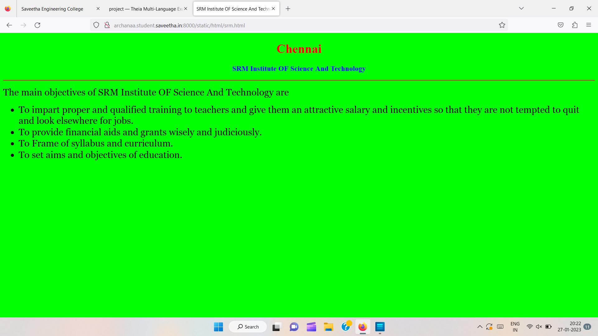
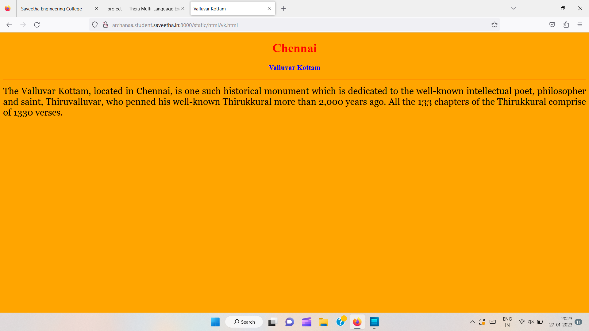
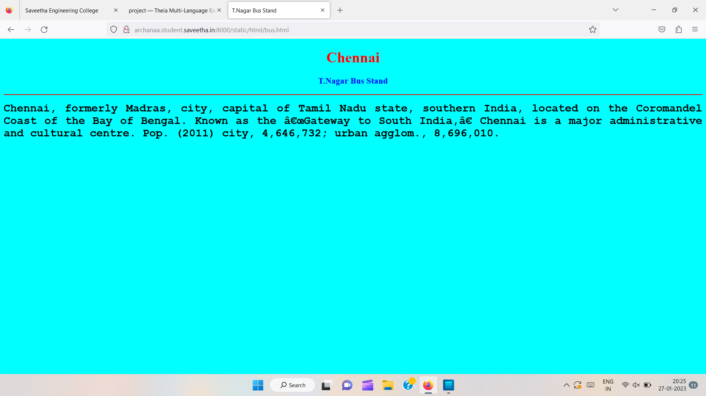
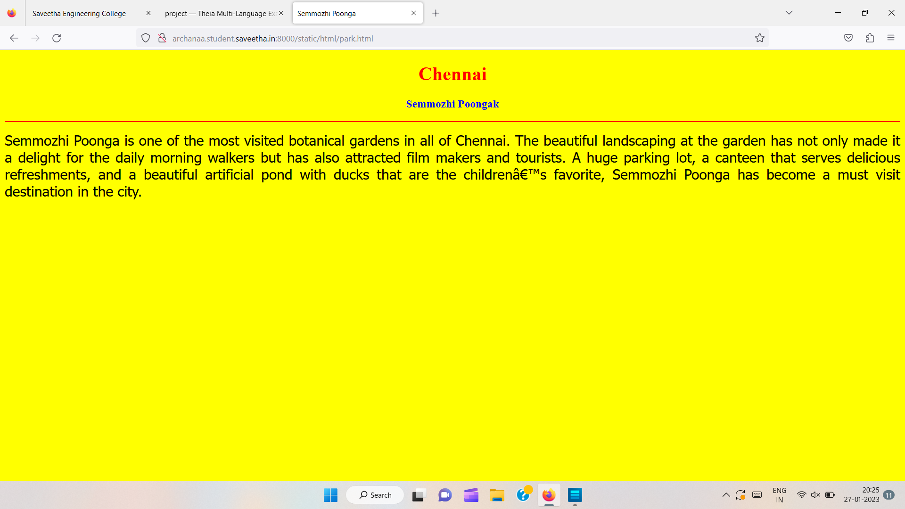
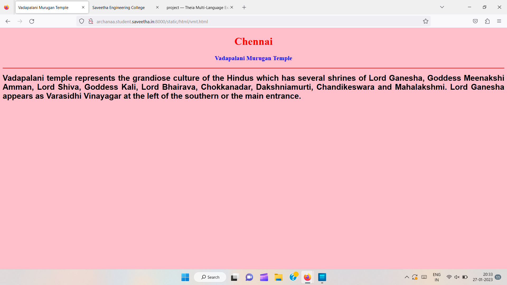
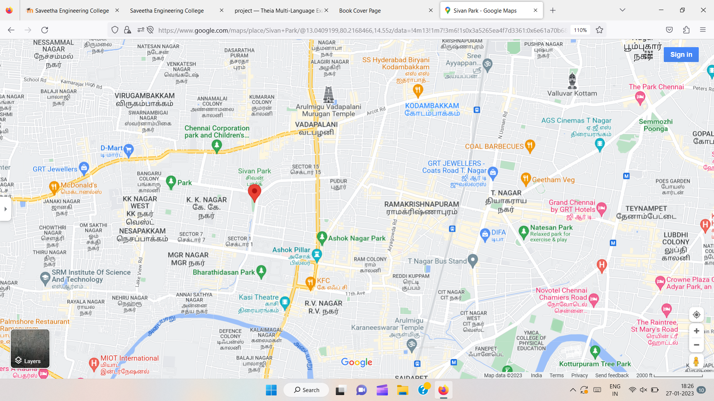
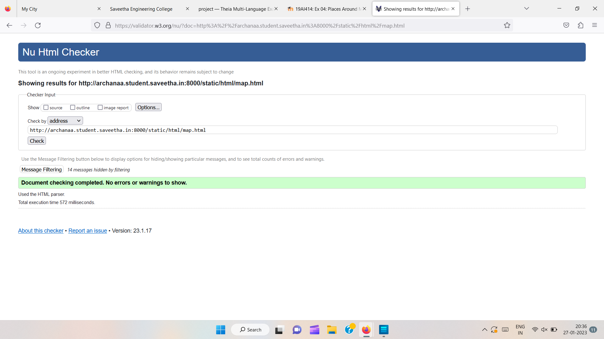

# Places Around Me
## AIM:
To develop a website to display details about the places around my house.

## Design Steps:

### Step 1:
Clone the github repository into Theia IDE.

### Step 2:
Create a new Django project

### Step 3:
write the needed HTML code.

### Step 4:
Run the Django server and execute the HTML files.
## Code:
```
map.html
<!DOCTYPE html>
<html lang="en">
<head>
<title>My City</title>
</head>
<body>
<h1 align="center">
<font color="red"><b>Chennai</b></font>
</h1>
<h3 align="center">
<font color="blue"><b>Archana S (22003222)</b></font>
</h3>
<center>

<map name="MyCity">
<area shape="circle" coords="190,50,20" href="/static/html/vmt.html" title="Vadapalani Murugan Temple">
<area shape="rectangle" coords="230,30,260,60" href="/static/html/srm.html" title="SRM Institut Of Science And Technology">
<area shape="circle" coords="400,350,50" href="/static/html/vk.html" title="Valluvar Kottam">
<area shape="circle" coords="400,200,75" href="/static/html/bus.html" title="T.Nagar  Bus Stand">
<area shape="rectangle" coords="490,150,870,320" href="/static/html/park.html" title="Semmozhi Poonga">
</map>
</center>
</body>
</html>


bus.html
<!DOCTYPE html>
<html lang="en">
<head>
<title>T.Nagar Bus Stand</title>
</head>
<body bgcolor="cyan">
<h1 align="center">
<font color="red"><b>Chennai</b></font>
</h1>
<h3 align="center">
<font color="blue"><b>T.Nagar Bus Stand</b></font>
</h3>
<hr size="3" color="red">
<p align="justify">
<font face="Courier New" size="5">
<b>
Chennai, formerly Madras, city, capital of Tamil Nadu state, southern India, located on the Coromandel Coast of the Bay of Bengal. Known as the “Gateway to South India,” Chennai is a major administrative and cultural centre. Pop. (2011) city, 4,646,732; urban agglom., 8,696,010.
</b>
</font>
</p>
</body>
</html>


vk.html
<!DOCTYPE html>
<html lang="en">
<head>
<title>Valluvar Kottam</title>
</head>
<body bgcolor="orange">
<h1 align="center">
<font color="red"><b>Chennai</b></font>
</h1>
<h3 align="center">
<font color="blue"><b>Valluvar Kottam</b></font>
</h3>
<hr size="3" color="red">
<p align="justify">
<font face="Georgia" size="5">
The Valluvar Kottam, located in Chennai, is one such historical monument which is dedicated to the well-known intellectual poet, philosopher and saint, Thiruvalluvar, who penned his well-known Thirukkural more than 2,000 years ago. All the 133 chapters of the Thirukkural comprise of 1330 verses.
</font>
</p>
</body>
</html>


srm.html
<!DOCTYPE html>
<html lang="en">
<head>
<title>SRM Institute OF Science And Technology</title>
</head>
<body bgcolor="lime">
<h1 align="center">
<font color="red"><b>Chennai</b></font>
</h1>
<h3 align="center">
<font color="blue"><b>SRM Institute OF Science And Technology</b></font>
</h3>
<hr size="3" color="red">
<p align="justify">
<font face="Georgia" size="5">
The main objectives of SRM Institute OF Science And Technology are 
<ul>
<li>To impart proper and qualified training to teachers and give them an attractive salary and incentives so that they are not tempted to quit and look elsewhere for jobs.</li>
<li>To provide financial aids and grants wisely and judiciously.</li>
<li>To Frame of syllabus and curriculum.</li>
<li>To set aims and objectives of education.</li>
</ul>
</font>
</p>
</body>
</html>


vmt.html
<!DOCTYPE html>
<html lang="en">
<head>
<title>Vadapalani Murugan Temple</title>
</head>
<body bgcolor="pink">
<h1 align="center">
<font color="red"><b>Chennai</b></font>
</h1>
<h3 align="center">
<font color="blue"><b>Vadapalani Murugan Temple</b></font>
</h3>
<hr size="3" color="red">
<p align="justify">
<font face="Arial" size="5">
<b>
Vadapalani temple represents the grandiose culture of the Hindus which has several shrines of Lord Ganesha, Goddess Meenakshi Amman, Lord Shiva, Goddess Kali, Lord Bhairava, Chokkanadar, Dakshniamurti, Chandikeswara and Mahalakshmi. Lord Ganesha appears as Varasidhi Vinayagar at the left of the southern or the main entrance.
</b>
</font>
</p>
</body>
</html>
```

## Output:












## HTML Validator


## Result:
The program for implementing image map is executed successfully
